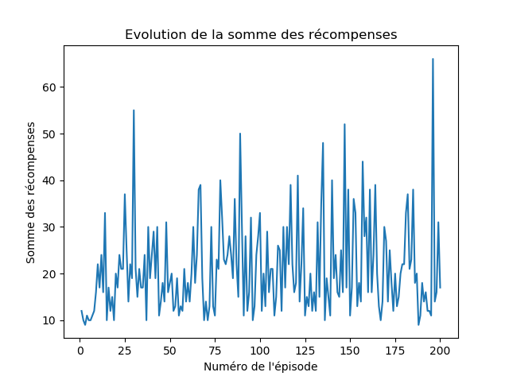

# TP Apprentissage Profond par Renforcement

## Auteurs

- Julian Bruyat 11706770

- Jean-Philippe Tisserand 11926733

## Environnement virtuel
- instalation : `python3.6 -m  venv .`
- activation : `source /bin/activate`
- desactivation : `deactivate`
- exportation des packages : `pip freeze > requirements.txt`
- importation des packages : `pip install -r requirements.txt`

## Préliminaires

Ce TP se repose sur l'utilisation de réseaux neuronaux profonds.

N'ayant jamais réalisé ce type de neurones de manière pratique auparavant, nous
proposons un simple script python qui démontre comment en mettre un en oeuvre
dans `XORLearn.py`.

## Partie 1 : CartPole

Le but de cette partie est de créer un agent évoluant dans l'environnement
*CartPole*.

Le CartPole est un jeu où nous contrôlons un chariot sur lequel est posé une
perche en équilibre. Le but est de déplacer ce chariot à gauche ou à droite
de sortes que le poteau reste le plus longtemps possible droit.

### Buffer

Un buffer est utilisé par l'agent d'une taille choisie à la construction de
l'agent.

Le bufffer est implémenté comme une liste dont les éléments sont réecrits
lorsque le nombre d'éléments dépasse la taille du buffer.

### Stratégie d'exploration

Deux stratégies d'exploration sont implémentées :
- L'Epsilon exploration
- L'exploration de Boltzmann.

La stratégie d'exploration est passée lors de la construction de l'agent.
Nous nous sommes focalisés sur l'utilisation de la méthode d'exploration
epsilon.

## Construction du réseau neuronal

Notre implémentation s'est faite en permettant à l'utilisateur de modifier via
les hyperparamètres le nombre de neurones dans les couches cachées.

Dans la pratique, initialement nous construisons un réseau neuronal avec 4
neurones en entrée, une couche cachée de 3 neurones et une couche de sortie de
2 neurones. Ce choix a été principalement fait pour limiter le temps de calcul.
Nous estimons que le jeu est assez simple pour ne pas requérir un grand nombre
de neurones.

Nous fixons de plus le taux d'apprentissage à 0.001, gamma (impact d'une
qValeur sur les états précédents) à 0.1, la taille du buffer à 100000, les
échantillons extraits à 40.

Pour le réseau avec un réseau cible, nous avons utilisé l'approche "recopier le
modèle toutes les N itérations" avec N = 4000 (soit tous les 100 samples).

Une amélioration possible serait de commencer avec un taux d'apprentissage haut,
et le diminuer au cours du temps. Cela permettrait d'avoir beaucoup moins
d'épisodes (nous en avons déroulé 2000).

Néanmoins lorsque nous avons expérimenté ces possibilités (changement de paramètres,
réduction du taux d'apprentissage au cours du temps avece le paramètre `weight_decay`
de l'optimiseur `Adam`, ...) nous ne sommes pas arrivés à des résultats très concluants.

Nous savons que l'agent apprend car dans des situations courantes,
il possède un comportement lui permettant de tenir très longtemps, mais
de nombreuses situations lui échappent.

Nous exposons ici la somme des récompenses (le nombre de pas avant de perdre)
avec 200 épisodes, gamma = 0.01, un taux d'apprentissage de 0.01, des samples
de 32, 3 neurones cachés et une copie du réseau de neurones cible tous les 10 batchs.

## Partie 2 : Atari

